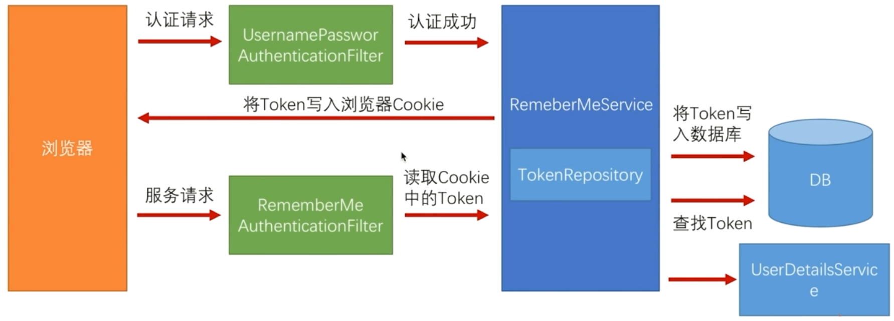
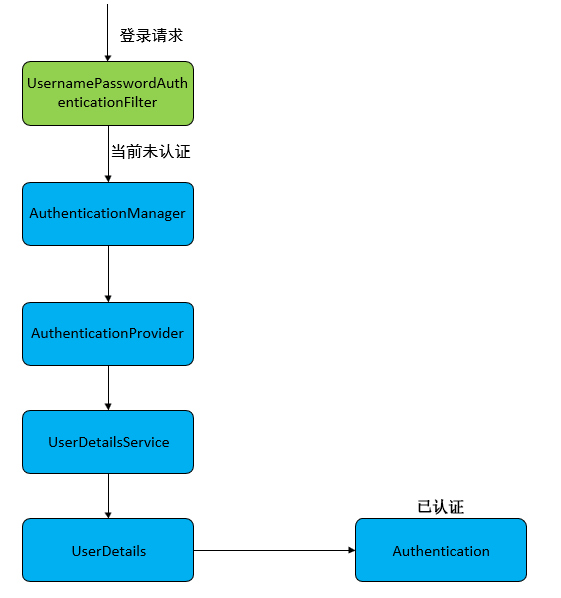

## springSecurity 学习
原文地址:[原文地址](https://blog.csdn.net/yuanlaijike/category_9283872.html)  
环境SpringBoot 2.2.2 + Mybatis + Spring Security 5.0  

### 入门程序
#### 导入依赖
```xml
<dependency>
	<groupId>org.springframework.boot</groupId>
	<artifactId>spring-boot-starter-web</artifactId>
</dependency>
<dependency>
	<groupId>org.springframework.boot</groupId>
	<artifactId>spring-boot-starter-test</artifactId>
	<scope>test</scope>
</dependency>
<dependency>
	<groupId>org.springframework.boot</groupId>
	<artifactId>spring-boot-starter-security</artifactId>
</dependency>
<dependency>
	<groupId>org.mybatis.spring.boot</groupId>
	<artifactId>mybatis-spring-boot-starter</artifactId>
	<version>1.3.1</version>
</dependency>
<dependency>
	<groupId>mysql</groupId>
	<artifactId>mysql-connector-java</artifactId>
</dependency>
```
#### 创建数据库
- 详见:    `com-boot-security/db/db.sql`  
- 一般权限控制有三层，即：用户<–>角色<–>权限，用户与角色是多对多，角色和权限也是多对多。这里我们先暂时不考虑权限，只考虑用户<–>角色

- 数据库中 role 的内容权限格式为ROLE_XXX，是Spring Security规定的，不要乱起名字哦。
- 用户的登陆认证是由Spring Security进行处理的，请求路径默认为/login，用户名字段默认为username，密码字段默认为password

#### 准备页面 
- 详见 `com-boot-security\src\main\resources\static` 下的页面
- 用户的登陆认证是由Spring Security进行处理的，请求路径默认为/login，用户名字段默认为username，密码字段默认为password

#### 配置application.properties
 主要配置数据源和myBatis 相关信息
 
 #### 创建实体、Dao、Service和Controller
 详见对应的类  
 - 如代码所示，获取当前登录用户： `SecurityContextHolder.getContext().getAuthentication()`
 - `@PreAuthorize` 用于判断用户是否有指定权限，没有就不能访问
 #### 配置SpringSecurity
 1. UserDetailsService
    - 首先我们需要自定义 UserDetailsService ，将用户信息和权限注入进来。
    - 我们需要重写 loadUserByUsername 方法，参数是用户输入的用户名。返回值是UserDetails，这是一个接口，一般使用它的子类org.springframework.security.core.userdetails.User，它有三个参数，分别是用户名、密码和权限集。
    - 实际情况下，大多将 DAO 中的 User 类继承 org.springframework.security.core.userdetails.User 返回。
    - 详见 `CustomUserDetailsService` 类
  2. WebSecurityConfig
    - 该类是 Spring Security 的配置类，该类的三个注解分别是标识该类是配置类、开启 Security 服务、开启全局 Securtiy 注解。
    - 首先将我们自定义的 userDetailsService 注入进来，在 configure() 方法中使用 auth.userDetailsService() 方法替换掉默认的 userDetailsService。
### 配置自动登录
#### 修改login.html
在登陆页添加自动登录的选项，注意自动登录字段的 name 必须是 remember-me ：
```html
<div>
        <label><input type="checkbox" name="remember-me"/>自动登录</label>
        <button type="submit">立即登陆</button>
    </div>
```
#### 两种实现方式
1. Cookie 存储（这种方式十分简单，只要在 WebSecurityConfig 中的 configure() 方法添加一个 rememberMe() 即可,如下所示：）
```java_holder_method_tree
@Override
protected void configure(HttpSecurity http) throws Exception {
    http.authorizeRequests()
            // 如果有允许匿名的url，填在下面
//                .antMatchers().permitAll()
            .anyRequest().authenticated()
            .and()
            // 设置登陆页
            .formLogin().loginPage("/login")
            // 设置登陆成功页
            .defaultSuccessUrl("/").permitAll()
            // 自定义登陆用户名和密码参数，默认为username和password
//                .usernameParameter("username")
//                .passwordParameter("password")
            .and()
            .logout().permitAll()
            // 自动登录
            .and().rememberMe();
    // 关闭CSRF跨域
    http.csrf().disable();
}
```
 2. 数据库存储  
Spring security 还提供了另一种相对更安全的实现机制：在客户端的 Cookie 中，仅保存一个无意义的加密串（与用户名、密码等敏感数据无关），然后在数据库中保存该加密串-用户信息的对应关系，自动登录时，用 Cookie 中的加密串，到数据库中验证，如果通过，自动登录才算通过。

    - 基本原理
        - 当浏览器发起表单登录请求时，当通过 UsernamePasswordAuthenticationFilter 认证成功后，会经过 RememberMeService，在其中有个 TokenRepository，它会生成一个 token，首先将 token 写入到浏览器的 Cookie 中，然后将 token、认证成功的用户名写入到数据库中。 
        - 当浏览器下次请求时，会经过 RememberMeAuthenticationFilter，它会读取 Cookie 中的 token，交给 RememberMeService 从数据库中查询记录。如果存在记录，会读取用户名并去调用 UserDetailsService，获取用户信息，并将用户信息放入Spring Security 中，实现自动登陆
    
        - RememberMeAuthenticationFilter 在整个过滤器链中是比较靠后的位置，也就是说在传统登录方式都无法登录的情况下才会使用自动登陆。
    
    
    - 代码实现
        1.添加token 存储表
        ```sql
        CREATE TABLE `persistent_logins` (
          `username` varchar(64) NOT NULL,
          `series` varchar(64) NOT NULL,
          `token` varchar(64) NOT NULL,
          `last_used` timestamp NOT NULL DEFAULT CURRENT_TIMESTAMP ON UPDATE CURRENT_TIMESTAMP,
          PRIMARY KEY (`series`)
        ) ENGINE=InnoDB DEFAULT CHARSET=utf8;
        ```
       2. 在 WebSecurityConfig 中注入 dataSource ，
       3. 在customWebConfig创建一个 PersistentTokenRepository 的Bean：
       4. 在 WebSecurityConfig 中注入 PersistentTokenRepository
       3. 在 config() 中配置自动登录信息
### 异常处理
这是因为首先 /login?error 是 Spring security 默认的失败 Url，其次如果你不手动处理这个异常，这个异常是不会被处理的。
#### 常见异常
我们先来列举下一些 Spring Security 中常见的异常：
    - UsernameNotFoundException（用户不存在）
    - DisabledException（用户已被禁用）
    - BadCredentialsException（坏的凭据）
    - LockedException（账户锁定）
    - AccountExpiredException （账户过期）
    - CredentialsExpiredException（证书过期）
    - ...

#### 源码分析
我们知道异常处理一般在过滤器中处理，我们在 AbstractAuthenticationProcessingFilter 中找到了对 AuthenticationException 的处理：
    1. 在 doFilter() 中，捕捉了 AuthenticationException 异常，并交给了 unsuccessfulAuthentication() 处理。
    2. 在 unsuccessfulAuthentication() 中，转交给了 SimpleUrlAuthenticationFailureHandler 类的 onAuthenticationFailure() 处理。
    3. 在onAuthenticationFailure()中，首先判断有没有设置defaultFailureUrl。
        * 如果没有设置，直接返回 401 错误，即 HttpStatus.UNAUTHORIZED 的值。
        * 如果设置了，首先执行 saveException() 方法。然后判断 forwardToDestination ，即是否是服务器跳转，默认使用重定向即客户端跳转。
        * 在 saveException() 方法中，首先判断forwardToDestination，如果使用服务器跳转则写入 Request，客户端跳转则写入 Session。写入名为 SPRING_SECURITY_LAST_EXCEPTION ，值为 AuthenticationException。
#### 处理异常
上面源码说了那么多，真正处理起来很简单，我们只需要指定错误的url，然后再该方法中对异常进行处理即可。
- 指定错误Url，WebSecurityConfig中添加.failureUrl("/login/error") `WebServiceConfig#config`
- 在Controller中处理异常 `LoginController#loginError`   
 
### 自定义表单登录
#### 添加验证码
1. 验证码的 Servlet 代码，大家无需关心其内部实现，我也是百度直接捞了一个，直接复制即可。
详见 `com.zbcn.combootsecurity.vertify.VerifyServlet`
2. 在 `CustomWebConfig` 中配置 `VerifyServlet`
3. 修改 login.html ,添加验证码获取信息
4. 添加匿名访问 Url
```java_holder_method_tree
@Override
protected void configure(HttpSecurity http) throws Exception {
    http.authorizeRequests()
            // 如果有允许匿名的url，填在下面
            .antMatchers("/getVerifyCode").permitAll()
            .anyRequest().authenticated()
            .and()
            // 设置登陆页
            .formLogin().loginPage("/login")
            // 设置登陆成功页
            .defaultSuccessUrl("/").permitAll()
            // 登录失败Url
            .failureUrl("/login/error")
            // 自定义登陆用户名和密码参数，默认为username和password
//                .usernameParameter("username")
//                .passwordParameter("password")
            .and()
            .logout().permitAll()
            // 自动登录
            .and().rememberMe()
                .tokenRepository(persistentTokenRepository())
                // 有效时间：单位s
                .tokenValiditySeconds(60)
                .userDetailsService(userDetailsService);

    // 关闭CSRF跨域
    http.csrf().disable();
}
```
#### 验证码的验证(推荐第三种)
>1. 登录表单提交前发送 AJAX 验证验证码
>2. 使用自定义过滤器(Filter)，在 Spring security 校验前验证验证码合法性
>3.  和用户名、密码一起发送到后台，在 Spring security 中进行验证
##### AJAX 验证
使用 AJAX 方式验证和我们 Spring Security 框架就没有任何关系了，其实就是表单提交前先发个 HTTP 请求验证验证码，本篇不再赘述。
#### 过滤器验证
使用过滤器的思路是：在 Spring Security 处理登录验证请求前，验证验证码，如果正确，放行；如果不正确，调到异常。

1. 编写验证码过滤器
自定义一个过滤器，实现 OncePerRequestFilter （该 Filter 保证每次请求一定会过滤），在 isProtectedUrl() 方法中拦截了 POST 方式的 /login 请求。
详见 `com.zbcn.combootsecurity.filter.VerifyFilter`
2. 注入过滤器  
修改 WebSecurityConfig 的 configure 方法，添加一个 addFilterBefore() ，具有两个参数，作用是在参数二之前执行参数一设置的过滤器。  

Spring Security 对于用户名/密码登录方式是通过 UsernamePasswordAuthenticationFilter 处理的，我们在它之前执行验证码过滤器即可。
```
@Override
protected void configure(HttpSecurity http) throws Exception {
    http.authorizeRequests()
            // 如果有允许匿名的url，填在下面
            .antMatchers("/getVerifyCode").permitAll()
            .anyRequest().authenticated()
            .and()
            // 设置登陆页
            .formLogin().loginPage("/login")
            // 设置登陆成功页
            .defaultSuccessUrl("/").permitAll()
            // 登录失败Url
            .failureUrl("/login/error")
            // 自定义登陆用户名和密码参数，默认为username和password
//                .usernameParameter("username")
//                .passwordParameter("password")
            .and()
            .addFilterBefore(new VerifyFilter(),UsernamePasswordAuthenticationFilter.class)
            .logout().permitAll()
            // 自动登录
            .and().rememberMe()
                .tokenRepository(persistentTokenRepository())
                // 有效时间：单位s
                .tokenValiditySeconds(60)
                .userDetailsService(userDetailsService);
    // 关闭CSRF跨域
    http.csrf().disable();
}
```

#### Spring Security 验证

使用过滤器就已经实现了验证码功能，但其实它和 AJAX 验证差别不大。  
AJAX 是在提交前发一个请求，请求返回成功就提交，否则不提交；  
过滤器是先验证验证码，验证成功就让 Spring Security 验证用户名和密码；验证失败，则产生异常。  
如果我们要做的需求是用户登录是需要多个验证字段，不单单是用户名和密码，那么使用过滤器会让逻辑变得复杂，这时候可以考虑自定义 Spring Security 的验证逻辑了…
1. WebAuthenticationDetails
我们知道 Spring security 默认只会处理用户名和密码信息。这时候就要请出我们的主角——WebAuthenticationDetails。 
> WebAuthenticationDetails: 该类提供了获取用户登录时携带的额外信息的功能，默认提供了 remoteAddress 与 sessionId 信息。

我们需要实现自定义的 WebAuthenticationDetails，并在其中加入我们的验证码：详见 `CustomWebAuthenticationDetails `

2. AuthenticationDetailsSource
自定义了WebAuthenticationDetails，我们还需要将其放入 AuthenticationDetailsSource 中来替换原本的 WebAuthenticationDetails ，因此还得实现自定义 AuthenticationDetailsSource
详见 `CustomAuthenticationDetailsSource `
该类内容将原本的 WebAuthenticationDetails 替换为了我们的 CustomWebAuthenticationDetails。

然后我们将 CustomAuthenticationDetailsSource 注入Spring Security中，替换掉默认的 AuthenticationDetailsSource。

修改 WebSecurityConfig，将其注入，然后在config()中使用 authenticationDetailsSource(authenticationDetailsSource)方法来指定它。
```
@Autowired
private AuthenticationDetailsSource<HttpServletRequest, WebAuthenticationDetails> authenticationDetailsSource;
@Override
protected void configure(HttpSecurity http) throws Exception {
    http.authorizeRequests()
            // 如果有允许匿名的url，填在下面
            .antMatchers("/getVerifyCode").permitAll()
            .anyRequest().authenticated()
            .and()
            // 设置登陆页
            .formLogin().loginPage("/login")
            // 设置登陆成功页
            .defaultSuccessUrl("/").permitAll()
            // 登录失败Url
            .failureUrl("/login/error")
            // 自定义登陆用户名和密码参数，默认为username和password
//                .usernameParameter("username")
//                .passwordParameter("password")
            // 指定authenticationDetailsSource
            .authenticationDetailsSource(authenticationDetailsSource)
            .and()
            .logout().permitAll()
            // 自动登录
            .and().rememberMe()
                .tokenRepository(persistentTokenRepository())
                // 有效时间：单位s
                .tokenValiditySeconds(60)
                .userDetailsService(userDetailsService);
    // 关闭CSRF跨域
    http.csrf().disable();
}
```
3. AuthenticationProvider
至此我们通过自定义WebAuthenticationDetails和AuthenticationDetailsSource将验证码和用户名、密码一起带入了Spring Security中，下面我们需要将它取出来。
详见 `CustomAuthenticationProvider`

4. 最后在 WebSecurityConfig 中将其注入，并在 config 方法中通过 auth.authenticationProvider() 指定使用。
```
@Autowired
private CustomAuthenticationProvider customAuthenticationProvider;
@Override
protected void configure(AuthenticationManagerBuilder auth) throws Exception {
    auth.authenticationProvider(customAuthenticationProvider);
}
```

### 权限控制
#### 创建 sys_permission 表
```sql
CREATE TABLE `sys_permission` (
  `id` int(11) NOT NULL AUTO_INCREMENT,
  `url` varchar(255) DEFAULT NULL,
  `role_id` int(11) DEFAULT NULL,
  `permission` varchar(255) DEFAULT NULL,
  PRIMARY KEY (`id`),
  KEY `fk_roleId` (`role_id`),
  CONSTRAINT `fk_roleId` FOREIGN KEY (`role_id`) REFERENCES `sys_role` (`id`) ON DELETE CASCADE ON UPDATE CASCADE
) ENGINE=InnoDB AUTO_INCREMENT=5 DEFAULT CHARSET=utf8;
```
#### 创建 POJO、Mapper、Service
1. `SysPermission`
2. `SysPermissionMapper`
3. `SysPermissionService`
3. LoginController 添加权限接口 `@PreAuthorize("hasPermission('/admin','r')")` 注解的方法

#### PermissionEvaluator
- 我们需要自定义对 hasPermission() 方法的处理，就需要自定义 PermissionEvaluator，创建类 CustomPermissionEvaluator，实现 PermissionEvaluator 接口。
- 思路如下：
  - 通过 Authentication 取出登录用户的所有 Role
  - 遍历每一个 Role，获取到每个Role的所有 Permission
  - 遍历每一个 Permission，只要有一个 Permission 的 url 和传入的url相同，且该 Permission 中包含传入的权限，返回 true
  - 如果遍历都结束，还没有找到，返回false

#### 在 CustomWebConfig 中注册 CustomPermissionEvaluator

### 登录管理
#### 自定义认证成功、失败处理
有些时候我们想要在认证成功后做一些业务处理，例如添加积分；有些时候我们想要在认证失败后也做一些业务处理，例如记录日志。
在之前的文章中，关于认证成功、失败后的处理都是如下配置的：
```
http.authorizeRequests()
	// 如果有允许匿名的url，填在下面
//    .antMatchers().permitAll()
	.anyRequest().authenticated().and()
	// 设置登陆页
	.formLogin().loginPage("/login")
	.failureUrl("/login/error")
	.defaultSuccessUrl("/")
	.permitAll()
	...;
```
即 failureUrl() 指定认证失败后Url，defaultSuccessUrl() 指定认证成功后Url。我们可以通过设置 successHandler() 和 failureHandler() 来实现自定义认证成功、失败处理。

PS：当我们设置了这两个后，需要去除 failureUrl() 和 defaultSuccessUrl() 的设置，否则无法生效。这两套配置同时只能存在一套。

1. CustomAuthenticationSuccessHandler
自定义 CustomAuthenticationSuccessHandler 类来实现 AuthenticationSuccessHandler 接口，用来处理认证成功后逻辑.详见 `CustomAuthenticationSuccessHandler`

2. CustomAuthenticationFailureHandler
自定义 CustomAuthenticationFailureHandler 类来实现 AuthenticationFailureHandler 接口，用来处理认证失败后逻辑.详见 `CustomAuthenticationFailureHandler`

3. 修改 WebSecurityConfig
```java
@Configuration
@EnableWebSecurity
@EnableGlobalMethodSecurity(prePostEnabled = true)
public class WebSecurityConfig extends WebSecurityConfigurerAdapter {
    @Autowired
    private CustomAuthenticationSuccessHandler customAuthenticationSuccessHandler;
    @Autowired
    private CustomAuthenticationFailureHandler customAuthenticationFailureHandler;
	...
    @Override
    protected void configure(HttpSecurity http) throws Exception {
        http.authorizeRequests()
                // 如果有允许匿名的url，填在下面
//                .antMatchers().permitAll()
                .anyRequest().authenticated().and()
                // 设置登陆页
                .formLogin().loginPage("/login")
                .successHandler(customAuthenticationSuccessHandler)
                .failureHandler(customAuthenticationFailureHandler)
//                .failureUrl("/login/error")
//                .defaultSuccessUrl("/")
                .permitAll()
                ...;
        // 关闭CSRF跨域
        http.csrf().disable();
    }
    ...
}
```
逻辑:
- 首先将 customAuthenticationSuccessHandler 和 customAuthenticationFailureHandler注入进来
- 配置 successHandler() 和 failureHandler()
- 注释 failureUrl() 和 defaultSuccessUrl()

#### Session 超时  
当用户登录后，我们可以设置 session 的超时时间，当达到超时时间后，自动将用户退出登录。  
Session 超时的配置是 SpringBoot 原生支持的，我们只需要在 application.properties 配置文件中配置：  
```yaml
# session 过期时间，单位：秒
server:
  servlet:
    session:
      timeout: 60
```
Tip：  
    - 从用户最后一次操作开始计算过期时间。
    - 过期时间最小值为 60 秒，如果你设置的值小于 60 秒，也会被更改为 60 秒。

- 我们可以在 Spring Security 中配置处理逻辑，在 session 过期退出时调用。修改 WebSecurityConfig 的 configure() 方法，添加
```
.sessionManagement()
	// 以下二选一
	//.invalidSessionStrategy()
	//.invalidSessionUrl();
```
    * pring Security 提供了两种处理配置，一个是 invalidSessionStrategy()，另外一个是 invalidSessionUrl()。
    * 这两个的区别就是一个是前者是在一个类中进行处理，后者是直接跳转到一个 Url。简单起见，我就直接用 invalidSessionUrl()了，跳转到 /login/invalid，我们需要把该 Url 设置为免授权访问， 配置如下：
    ```
    @Override
    protected void configure(HttpSecurity http) throws Exception {
        http.authorizeRequests()
                // 如果有允许匿名的url，填在下面
                .antMatchers("/login/invalid").permitAll()
                .anyRequest().authenticated().and()
                ...
                .sessionManagement()
                    .invalidSessionUrl("/login/invalid");
    
        // 关闭CSRF跨域
        http.csrf().disable();
    }
    ```
- 在 controller 中写一个接口进行处理
```
@RequestMapping("/login/invalid")
@ResponseStatus(HttpStatus.UNAUTHORIZED)
@ResponseBody
public String invalid() {
    return "Session 已过期，请重新登录";
}
```
#### 限制最大登录数
接下来实现限制最大登陆数，原理就是限制单个用户能够存在的最大 session 数。  
修改 configure() 为：
```
.sessionManagement()
	.invalidSessionUrl("/login/invalid")
	.maximumSessions(1)
	// 当达到最大值时，是否保留已经登录的用户
	.maxSessionsPreventsLogin(false)
	// 当达到最大值时，旧用户被踢出后的操作
    .expiredSessionStrategy(new CustomExpiredSessionStrategy())
```
- 增加了下面三行代码，其中:
    - maximumSessions(int)：指定最大登录数
    - maxSessionsPreventsLogin(boolean)：是否保留已经登录的用户；为true，新用户无法登录；为 false，旧用户被踢出
    - expiredSessionStrategy(SessionInformationExpiredStrategy)：旧用户被踢出后处理方法
        maxSessionsPreventsLogin()可能不太好理解，这里我们先设为 false，效果和 QQ 登录是一样的，登陆后之前登录的账户被踢出。

- CustomExpiredSessionStrategy  详见 `CustomExpiredSessionStrategy`   

#### 踢出用户
- 首先需要在容器中注入名为 SessionRegistry 的 Bean
```
@Bean
public SessionRegistry sessionRegistry() {
    return new SessionRegistryImpl();
}
``` 
- 修改 WebSecurityConfig 的 configure() 方法，在最后添加一行 .sessionRegistry().详见代码

- 编写一个接口用于测试踢出用户.详见 `LoginController#removeUserSessionByUsername`
    - sessionRegistry.getAllPrincipals(); 获取所有 principal 信息
    - 通过 principal.getUsername 是否等于输入值，获取到指定用户的 principal
    - sessionRegistry.getAllSessions(principal, false)获取该 principal 上的所有 session
    - 通过 sessionInformation.expireNow() 使得 session 过期

#### 退出登录
- 补充一下退出登录的内容，在之前，我们直接在 WebSecurityConfig 的 configure() 方法中，配置了 `http.logout();`
- 这就是 Spring Security 的默认退出配置，Spring Security 在退出时候做了这样几件事
    * 使当前的 session 失效
    * 清除与当前用户有关的 remember-me 记录
    * 清空当前的 SecurityContext
    * 重定向到登录页
- Spring Security 默认的退出 Url 是 /logout，我们可以修改默认的退出 Url，例如修改为 /signout
    ```
    http.logout()
        .logoutUrl("/signout") //修改默认的退出 Url为:/signout
        .deleteCookies("JSESSIONID")//清除浏览器的 名为 JSESSIONID 的 cookie
        .logoutSuccessHandler(logoutSuccessHandler);//可以配置退出后处理的逻辑
   ```
 - 推出后的逻辑类 `DefaultLogoutSuccessHandler` 详见代码
 
 #### Session 共享
- 配置 Redis
- 添加maven 依赖
```maven
<dependency>
    <groupId>org.springframework.boot</groupId>
    <artifactId>spring-boot-starter-data-redis</artifactId>
</dependency>
<dependency>
    <groupId>org.springframework.session</groupId>
    <artifactId>spring-session-data-redis</artifactId>
</dependency>
``` 
- 添加 session存储配置和redis
```yaml
spring:
 redis:
    host: 10.6.224.246
    port: 6379
  session:
    store-type: redis
```
- 启动类添加 `@EnableRedisHttpSession`


### 短信验证码登录  

__目前短信验证和普通的验证是冲突的，如果使用短信验证，打开`SmsWebSecurityConfig`，关闭 普通的 `WebSecurityConfig`配置，反之，执行相反的操作__
#### 基本逻辑
1. 用户名密码登录逻辑
    1. 先进入 UsernamePasswordAuthenticationFilter 中，根据输入的用户名和密码信息，构造出一个暂时没有鉴权的 UsernamePasswordAuthenticationToken，并将 UsernamePasswordAuthenticationToken 交给 AuthenticationManager 处理。
    2. AuthenticationManager 本身并不做验证处理，他通过 for-each 遍历找到符合当前登录方式的一个 AuthenticationProvider，并交给它进行验证处理，对于用户名密码登录方式，这个 Provider 就是 DaoAuthenticationProvider。
    3. 在这个 Provider 中进行一系列的验证处理，如果验证通过，就会重新构造一个添加了鉴权的 UsernamePasswordAuthenticationToken，并将这个 token 传回到 UsernamePasswordAuthenticationFilter 中。
    4. 在该 Filter 的父类 AbstractAuthenticationProcessingFilter 中，会根据上一步验证的结果，跳转到 successHandler 或者是 failureHandler。


2. 短信验证码登录逻辑
    1. 用户名密码登录有个 UsernamePasswordAuthenticationFilter ，我们搞一个 SmsAuthenticationFilter，代码粘过来改一改。
    2. 用户名密码登录需要 UsernamePasswordAuthenticationToken，我们搞一个 SmsAuthenticationToken，代码粘过来改一改。
    3. 用户名密码登录需要 DaoAuthenticationProvider，我们模仿它也 implenments AuthenticationProvider，叫做 SmsAuthenticationProvider。
   
    
3. 当我们使用短信验证码登录的时候：
    1. 先经过 SmsAuthenticationFilter，构造一个没有鉴权的 SmsAuthenticationToken，然后交给 AuthenticationManager 处理。
    2. AuthenticationManager 通过 for-each 挑选出一个合适的 provider 进行处理，当然我们希望这个 provider 要是 SmsAuthenticationProvider。
    3. 验证通过后，重新构造一个有鉴权的 SmsAuthenticationToken，并返回给 SmsAuthenticationFilter。
    4. filter 根据上一步的验证结果，跳转到成功或者失败的处理逻辑。
#### 代码实战
- SmsAuthenticationToken
    1. principal 原本代表用户名，这里保留，只是代表了手机号码。
    2. credentials 原本代码密码，短信登录用不到，直接删掉。
    3. SmsCodeAuthenticationToken() 两个构造方法一个是构造没有鉴权的，一个是构造有鉴权的。
    4. 剩下的几个方法去除无用属性即可。
- SmsAuthenticationFilter
    1. 原本的静态字段有 username 和 password，都干掉，换成我们的手机号字段。
    2. SmsCodeAuthenticationFilter() 中指定了这个 filter 的拦截 Url，我指定为 post 方式的 /sms/login。
    3. 剩下来的方法把无效的删删改改就好了。

- SmsAuthenticationProvider
    1. 实现 AuthenticationProvider 接口，实现 authenticate() 和 supports() 方法。
    2. supports() 方法决定了这个 Provider 要怎么被 AuthenticationManager 挑中，我这里通过 return SmsCodeAuthenticationToken.class.isAssignableFrom(authentication)，处理所有 SmsCodeAuthenticationToken 及其子类或子接口。
    3. authenticate() 方法处理验证逻辑。
        - 首先将 authentication 强转为 SmsCodeAuthenticationToken。
        - 从中取出登录的 principal，也就是手机号。
        - 调用自己写的 checkSmsCode() 方法，进行验证码校验，如果不合法，抛出 AuthenticationException 异常。
        - 如果此时仍然没有异常，通过调用 loadUserByUsername(mobile) 读取出数据库中的用户信息。
        - 如果仍然能够成功读取，没有异常，这里验证就完成了。
        - 重新构造鉴权后的 SmsCodeAuthenticationToken，并返回给 SmsCodeAuthenticationFilter 。
    4. SmsCodeAuthenticationFilter 的父类在 doFilter() 方法中处理是否有异常，是否成功，根据处理结果跳转到登录成功/失败逻辑。
- 成功与失败处理逻辑 `CustomAuthenticationSuccessHandler `, `CustomAuthenticationFailureHandler `

- SmsCodeAuthenticationSecurityConfig

    - 下面我们需要把我们自己写的这么多类添加进 Spring Security 框架中，在以往，我们都是直接往 WebSecurityConfig 中加，但是这样会导致 WebSecurityConfig 内容太多，难以维护。
    - 因此我们可以为每种登录方式都建议一个专属于它的配置文件，再把这个配置文件加入到 WebSecurityConfig 中，进行解耦。

- SmsWebSecurityConfig
```java
@Configuration
@EnableWebSecurity
@EnableGlobalMethodSecurity(prePostEnabled = true)
public class WebSecurityConfig extends WebSecurityConfigurerAdapter {

    @Autowired
    private SmsCodeAuthenticationSecurityConfig smsCodeAuthenticationSecurityConfig;

    @Override
    protected void configure(HttpSecurity http) throws Exception {
        http.apply(smsCodeAuthenticationSecurityConfig).and().authorizeRequests()
                // 如果有允许匿名的url，填在下面
                .antMatchers("/sms/**").permitAll()
                .anyRequest().authenticated()
                .and()
                // 设置登陆页
                .formLogin().loginPage("/login")
                // 设置登陆成功页
                .defaultSuccessUrl("/").permitAll()
                .and()
                .logout().permitAll();

        // 关闭CSRF跨域
        http.csrf().disable();
    }

    @Override
    public void configure(WebSecurity web) throws Exception {
        // 设置拦截忽略文件夹，可以对静态资源放行
        web.ignoring().antMatchers("/css/**", "/js/**");
    }
}
```

### 角色继承

我们存在两个角色，ROLE_ADMIN 和 ROLE_USER，并且经过我们的实验，/admin 接口只有 ROLE_ADMIN 有权限，/user 接口只有 ROLE_USER 有权限.但是如果我想让 ROLE_ADMIN 用户继承 ROLE_USER 用户的所有权限，该如何做呢？
#### RoleHierarchy
这里就需要引入 RoleHierarch 了，我们只需要自定义一个 RoleHierarchy，并将其注入容器即可。修改 WebSecurityConfig，在其中注入 RoleHierarchy
```
@Bean
	public RoleHierarchy roleHierarchy() {
		String separator = System.lineSeparator();
		RoleHierarchyImpl roleHierarchy = new RoleHierarchyImpl();
		String hierarchy = "ROLE_ADMIN > ROLE_USER " + separator + " ROLE_USER > ROLE_TOURISTS";
		roleHierarchy.setHierarchy(hierarchy);
		return roleHierarchy;
	}
```