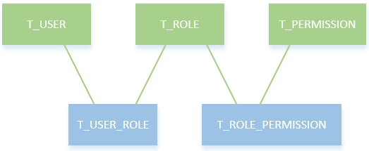

## Spring Boot Shiro-authorization 权限校验
- 授权也称为访问控制，是管理资源访问的过程。即根据不同用户的权限判断其是否有访问相应资源的权限。在Shiro中，权限控制有三个核心的元素：权限，角色和用户。

### 数据库模型设计
在这里，我们使用RBAC(role based access controller 基于角色的访问控制)模型设计用户、角色和权限之间的关系。简单的说：一个用户拥有若干个角色，每个角色拥有若干个权限。这样就构成了“用户-角色-权限” 的授权模型。用户与角色之间，角色与权限之间一般是多对多关系，如下图：


- 依据图设计表
```sql
-- ----------------------------
-- Table structure for T_PERMISSION
-- ----------------------------
CREATE TABLE `SCOTT`.`T_PERMISSION` (
    ID BIGINT NOT NULL primary key  COMMENT '主键',
    URL VARCHAR(256) NULL COMMENT 'url地址',
    NAME VARCHAR(66) NULL COMMENT '地址描述'
)
-- ----------------------------
-- Records of T_PERMISSION
-- ----------------------------
INSERT INTO SCOTT.T_PERMISSION VALUES (1, '/user', 'user:user');
INSERT INTO SCOTT.T_PERMISSION VALUES (2, '/user/add', 'user:add');
INSERT INTO SCOTT.T_PERMISSION VALUES (3, '/user/delete', 'user:delete');

-- ----------------------------
-- Table structure for T_ROLE
-- ----------------------------
CREATE TABLE `SCOTT`.`T_ROLE`(
    ID BIGINT NOT NULL primary key  COMMENT '主键',
    NAME VARCHAR(32) NULL COMMENT '角色名称',
    MEMO VARCHAR(32) NULL COMMENT '角色描述'
)
-- ----------------------------
-- Records of T_ROLE
-- ----------------------------
INSERT INTO SCOTT.T_ROLE VALUES (1, 'admin', '超级管理员');
INSERT INTO SCOTT.T_ROLE VALUES (2, 'test', '测试账户');

-- ----------------------------
-- Table structure for T_ROLE_PERMISSION
-- ----------------------------
CREATE TABLE SCOTT.T_ROLE_PERMISSION (
    RID BIGINT NULL COMMENT '角色id',
    PID BIGINT NULL COMMENT '权限id'
)

-- ----------------------------
-- Records of T_ROLE_PERMISSION
-- ----------------------------
INSERT INTO SCOTT.T_ROLE_PERMISSION VALUES (1, 2);
INSERT INTO SCOTT.T_ROLE_PERMISSION VALUES (1, 3);
INSERT INTO SCOTT.T_ROLE_PERMISSION VALUES (2, 1);
INSERT INTO SCOTT.T_ROLE_PERMISSION VALUES (1, 1);

-- ----------------------------
-- Table structure for T_USER
-- ----------------------------
CREATE TABLE `SCOTT`.`T_USER` (
   ID BIGINT NOT NULL primary key COMMENT '主键',
   USERNAME VARCHAR(20) NOT NULL COMMENT '用户名',
   PASSWD VARCHAR(128) NOT NULL COMMENT '密码',
   CREATE_TIME DATE NULL COMMENT '创建时间',
   STATUS CHAR NOT NULL COMMENT '是否有效 1：有效  0：锁定'
);

-- ----------------------------
-- Records of T_USER
-- ----------------------------
INSERT INTO SCOTT.T_USER VALUES (2, 'test', '7a38c13ec5e9310aed731de58bbc4214', DATE('2017-11-19 17:20:21'), '0');
INSERT INTO SCOTT.T_USER VALUES (1, 'zbcn', '42ee25d1e43e9f57119a00d0a39e5250', DATE('2017-11-19 10:52:48'), '1');

-- ----------------------------
-- Table structure for T_USER_ROLE
-- ----------------------------
CREATE TABLE `SCOTT`.`T_USER_ROLE`(
    USER_ID BIGINT NULL COMMENT '用户id',
    ROLE_ID BIGINT NULL COMMENT '角色id'
)
-- ----------------------------
-- Records of T_USER_ROLE
-- ----------------------------
INSERT INTO SCOTT.T_USER_ROLE VALUES (1, 1);
INSERT INTO SCOTT.T_USER_ROLE VALUES (2, 2);
```
- 上面的sql创建了五张表：用户表T_USER、角色表T_ROLE、用户角色关联表T_USER_ROLE、权限表T_PERMISSION和权限角色关联表T_ROLE_PERMISSION。
- 用户zbcn角色为admin，用户tester角色为test。admin角色拥有用户的所有权限（user:user,user:add,user:delete），而test角色只拥有用户的查看权限（user:user）。
- 密码都是123456，经过Shiro提供的MD5加密。

### 实体类层
- Role
- Permission
### mapper 层
- UserRoleMapper
- UserPermissionMapper

### ShiroRealm 
- 在Shiro中，用户角色和权限的获取是在Realm的doGetAuthorizationInfo()方法中实现的，所以接下来手动实现该方法：
```java
public class ShiroRealm extends AuthorizingRealm {
    @Autowired
    private UserMapper userMapper;
    @Autowired
    private UserRoleMapper userRoleMapper;
    @Autowired
    private UserPermissionMapper userPermissionMapper;

    /**
     * 获取用户角色和权限
     */
    @Override
    protected AuthorizationInfo doGetAuthorizationInfo(PrincipalCollection principal) {
        User user = (User) SecurityUtils.getSubject().getPrincipal();
        String userName = user.getUserName();
        
        System.out.println("用户" + userName + "获取权限-----ShiroRealm.doGetAuthorizationInfo");
        SimpleAuthorizationInfo simpleAuthorizationInfo = new SimpleAuthorizationInfo();
        
        // 获取用户角色集
        List<Role> roleList = userRoleMapper.findByUserName(userName);
        Set<String> roleSet = new HashSet<String>();
        for (Role r : roleList) {
            roleSet.add(r.getName());
        }
        simpleAuthorizationInfo.setRoles(roleSet);
        
        // 获取用户权限集
        List<Permission> permissionList = userPermissionMapper.findByUserName(userName);
        Set<String> permissionSet = new HashSet<String>();
        for (Permission p : permissionList) {
            permissionSet.add(p.getName());
        }
        simpleAuthorizationInfo.setStringPermissions(permissionSet);
        return simpleAuthorizationInfo;
    }

    /**
     * 登录认证
     */
    @Override
    protected AuthenticationInfo doGetAuthenticationInfo(AuthenticationToken token) throws AuthenticationException {
        // 登录认证已经实现过，这里不再贴代码
    }
}
```
- 我们通过方法userRoleMapper.findByUserName(userName)和userPermissionMapper.findByUserName(userName)获取了当前登录用户的角色和权限集，然后保存到SimpleAuthorizationInfo对象中，并返回给Shiro，这样Shiro中就存储了当前用户的角色和权限信息了。

### shiroConfig 修改
- Shiro为我们提供了一些和权限相关的注解，如下所示：
```java
// 表示当前Subject已经通过login进行了身份验证；即Subject.isAuthenticated()返回true。
@RequiresAuthentication  
// 表示当前Subject已经身份验证或者通过记住我登录的。
@RequiresUser  
// 表示当前Subject没有身份验证或通过记住我登录过，即是游客身份。
@RequiresGuest  
// 表示当前Subject需要角色admin和user。  
@RequiresRoles(value={"admin", "user"}, logical= Logical.AND)  
// 表示当前Subject需要权限user:a或user:b。
@RequiresPermissions (value={"user:a", "user:b"}, logical= Logical.OR)
```
- 要开启这些注解的使用，需要在ShiroConfig中添加如下配置：
```java
@Bean
public AuthorizationAttributeSourceAdvisor authorizationAttributeSourceAdvisor(SecurityManager securityManager) {
    AuthorizationAttributeSourceAdvisor authorizationAttributeSourceAdvisor = new AuthorizationAttributeSourceAdvisor();
    authorizationAttributeSourceAdvisor.setSecurityManager(securityManager);
    return authorizationAttributeSourceAdvisor;
}
```

### Controller
- 添加 UserController，用于处理User类的访问请求，并使用Shiro权限注解控制权限
- 在LoginController中添加一个/403跳转：

###  前端页面
- 对index.html进行改造，添加三个用户操作的链接：
```html
<!DOCTYPE html>
<html xmlns:th="http://www.thymeleaf.org">
<head>
    <meta charset="UTF-8">
    <title>首页</title>
</head>
<body>
    <p>你好！[[${user.userName}]]</p>
    <h3>权限测试链接</h3>
    <div>
        <a th:href="@{/user/list}">获取用户信息</a>
        <a th:href="@{/user/add}">新增用户</a>
        <a th:href="@{/user/delete}">删除用户</a>
    </div>
    <a th:href="@{/logout}">注销</a>
</body>
</html>
```
- 添加 user.html
- 添加 403.html


